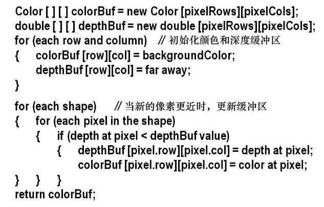

## OpenGL 管线

在管线中，将 3D 场景转换成 2D 图形的过程被分割成多个步骤：
- 顶点（Vertex）处理：
  - `顶点着色器`：将顶点数据发送到管线
- 图元（Primitive）（例如三角形）处理
  - `曲面细分着色器`：将顶点组合为三角形（这一过程称为图元封装）
  - `几何着色器`：将简单模型转换为复杂的模型
    - 让图元变形：拉伸或缩放
    - 删除部分图元
    - 生成额外图元，例如增加表面纹理（如凸起、鳞片、毛发等）
- 片段（Fragment）（像素）处理
  - 光栅着色器：将图元转换成矩形像素阵列
    - 对所有图元的每个顶点进行差值（填充图形）
    - 将图元转换为片段（片段中记录相关的像素信息）
  - `片段着色器`:为每个片段生成 RGB 颜色
- 像素操作
  - 隐藏面消除：协调颜色缓冲区和深度缓冲区完成隐藏面消除
    - 颜色缓冲区：缓存片段着色器生成的颜色
    - 深度缓冲区（z-buffer）：
    - 隐藏面消除的步骤（z-buffer 算法）：
      - 每个场景渲染前，深度缓冲区全部初始化为最大深度值
      - 计算片段着色器输出的颜色到观察者之间的距离
        - 如果距离小于深度缓冲区存储的值（对当前像素），那么用当前像素颜色替换颜色缓冲区中的颜色，同时用当前距离替换深度缓冲区中的值
  

  
顶点着色器、曲面细分着色器、几何着色器、片段着色器可以用 GLSL (GL Shader Language)进行编程:
- 顶点着色器提供一次处理一个顶点的能力
- 几何着色器提供一次操作一个图元的能力（一次访问所有三角形的所有顶点）
- 片段着色器提供一次处理一个像素的能力

将GLSL程序载入这些着色器阶段也是C++/OpenGL程序的责任之一，其过程如下：
1. 首先使用C++获取GLSL`着色器代码`，既可以从文件中读取，也可以硬编码在字符串中。
2. 接下来创建OpenGL`着色器对象`（Shader Object）并将GLSL着色器代码加载进着色器对象。
3. 用OpenGL命令`编译并连接着色器对象`，并将它们`安装进GPU`。

GLFW 库包含了 GLFWwindow 类，可以在其上进行3D场景绘制。