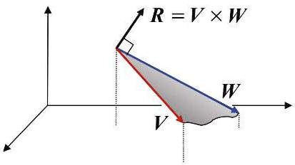

# 向量

3D 图形学中，向量一般用空间中的单个点表示，向量的大小是原点到该点的距离，方向是原点到该点的方向。

## 向量符号

- 向量记作 $\vec{a}$ 或 $\textbf{a}$ 或 $\overrightarrow{AB}$
- 向量的坐标表示：
  - $A = \left(\begin{matrix}x\\y\end{matrix}\right)$
  - $A^T = \left(\begin{matrix}x & y\end{matrix}\right)$
- 向量的大小：
  - $||\vec{a}||$
  - 坐标表示：$||\vec{a}|| = \sqrt{x^2 + y^2}$

## 单位向量
- 单位向量用来代表方向
- 单位向量长度为 1
- 求解一个向量的单位向量：$\hat a = \vec a / ||\vec a||$
  > glm::normalize(vec3) 或 normalize(vec4)

## 向量常用操作：
- 加法
  - 平行四边形法则
  - 三角形法则
- 点积:
  - $
  \vec{a} \cdot \vec{b} = 
  \left(\begin{matrix}
    x_a\\
    y_a\\
    z_a
  \end{matrix}\right)
  \left(\begin{matrix}
    x_b\\
    y_b\\
    z_b
  \end{matrix}\right) 
  =  x_ax_b + y_ay_b + z_az_b$
    > dot(vec3, vec3) 或 dot(vec4, vec4)
  - 矩阵表示法：
  $
  \vec{a} × \vec{b} = \vec{a}^T × \vec{b}
  \left(
  \begin{matrix}
    x_a y_a z_a\\
  \end{matrix}
  \right)
  =  x_ax_b + y_ay_b + z_az_b
  $
  - 属性：
    - $\vec a \cdot \vec b = \vec b \cdot \vec a$
    - $\vec a \cdot (\vec b + \vec c) = \vec a \cdot \vec b + \vec a \cdot \vec c$
    - $(k\vec a) \cdot \vec b = \vec a \cdot (k\vec b) = k(\vec a \cdot \vec b)$
- 叉积:
  - $
  \vec{a} × \vec{b} = 
    \left(\begin{matrix}
    x_a\\
    y_a\\
    z_a
  \end{matrix}\right)
  \left(\begin{matrix}
    x_b\\
    y_b\\
    z_b
  \end{matrix}\right) =
  \left(\begin{matrix}
    y_az_b - z_ay_b\\ 
    z_ax_b - x_az_b\\ 
    x_ay_b - y_ax_b
  \end{matrix}\right)
  $

  - 矩阵表示法：
  $
  \vec{a} × \vec{b}=A^*b=
  \left(\begin{matrix}
    0 & -z_a & y_a\\ 
    z_a & 0 & -x_a\\ 
    -y_a & x_a & 0
  \end{matrix}\right)
  \left(\begin{matrix}
    x_b\\
    y_b\\
    z_b
  \end{matrix}\right)
  $
   > cross(vec3, vec3) 或 cross(vec4, vec4)
   > 大小：magnitude
   > refection
   > refraction
  - 性质：
    - $\vec x \times \vec y = +\vec z$
    - $\vec y \times \vec x = -\vec z$
    - $\vec y \times \vec z = +\vec x$
    - $\vec z \times \vec y = -\vec x$
    - $\vec z \times \vec x = +\vec y$
    - $\vec x \times \vec z = -\vec y$
    - $\vec a \times \vec b = -\vec b \times \vec a$
    - $\vec a \times \vec a = 0$
    - $\vec a \times (\vec b + \vec c) = \vec a \times \vec b + \vec a \times \vec c$
    - $\vec a \times (k\vec b) = k(\vec a \times \vec b)$
  
### 点积的应用

- 点积最基本的应用是求解两向量的夹角：
  - 设向量 $\vec{a}$ 和 $\vec{b}$ ，其夹角为 $\theta$，则点积为：$\vec{a} \cdot \vec{b} = ||\vec{a}|| ||\vec{b}|| cos\theta$。
  - 如果 a 和 b 是单位向量，则点积为 $\hat{a} \cdot \hat{b} = cos\theta$。

点积的其他作用：
- 求解向量的大小：$\sqrt{\vec a \cdot \vec a}$
- 求解两向量是否正交（垂直），如果正交，则 $\vec a \cdot \vec b = 0$
- 求解两个向量是否平行，如果平行，则 $\vec a \cdot \vec b = ||\vec a||||\vec b||$，若反向平行，则 $\vec a \cdot \vec b = -||\vec a||||\vec b||$
- 求解向量在其他向量上的投影：$\vec b_\perp=k\hat a$，
  - 其中 $k= ||\vec b_\perp|| = ||\vec b||cos \theta$
    
    

- 求解两向量是否同向（夹角在 (-90&deg; ~ 90&deg;) 之间）：
  - $\vec a \cdot \vec b > 0$： 同向
  - $\vec a \cdot \vec c < 0$： 反向
- 求解两向量的接近程度：
  - $\vec a \cdot \vec b \rightarrow 1$： 同向平行
  - $\vec a \cdot \vec c \rightarrow -1$：反向平行
  
  

- 在3D空间分解向量：当 x y z 为单位向量
  - $\vec p = (\vec p \cdot \hat x)\hat x + (\vec p \cdot \hat y)\hat y + (\vec p \cdot \hat z)\hat z = ||\vec p_\perp||\hat x + ||\vec p_\perp||\hat y + ||\vec p_\perp||\hat z$

- 求解点 P=(x, y, z) 到平面 S=(a, b, c, d) 的最小有符号距离：
  1. 求解垂直于 S 的单位法向量： 
   $$
    n=
      \left(
        \frac{a}{\sqrt{a^2 + b^2 + c^2}}, 
        \frac{b}{\sqrt{a^2 + b^2 + c^2}}, 
        \frac{c}{\sqrt{a^2 + b^2 + c^2}}
      \right)
   $$
  2. 求解原点到平面的最短距离： 
   $$
   D=\frac{d}{\sqrt{a^2 + b^2 + c^2}}
   $$
  - 求解从 P 到 S 的最小有符号距离： $(n \cdot P) + D$ ，符号由 P 在 S 的那边决定。
  
## 叉积

两向量叉积的重要特性：它会生成一个新的向量，新的向量正交（垂直）于之前两个向量所定义的平面所定义的平面。

例如：$c = a × b$，则 c 垂直于 a -> b (右手螺旋定则，逆时针)所定义的平面

另外，$a × b=-(b × a)$

- 确定光照效果：确定所渲染模型的`外向法向量`.

  

- 确定 $\vec  b$ 是否在 $\vec a$ 的左侧，如果在左侧，则 $\vec a \times \vec b > 0$

  

- 确定点 p 是否在三角形 abc 内部
  - $\overrightarrow{AB} \times \overrightarrow{AP} > 0$ && $\overrightarrow{BC} \times \overrightarrow{BP} > 0$ && $\overrightarrow{CA} \times \overrightarrow{CP} > 0$ 
  > 三角形光栅化的基础

  