- [缩放变换 Scale](#缩放变换-scale)
  - [缩放矩阵](#缩放矩阵)
  - [图形的缩放变换计算](#图形的缩放变换计算)
  - [向量的缩放变换计算](#向量的缩放变换计算)
- [反射变换 Reflection](#反射变换-reflection)
  - [反射矩阵](#反射矩阵)
  - [图形的反射变换计算](#图形的反射变换计算)
  - [向量的反射变换计算](#向量的反射变换计算)
- [剪切变换 Shear](#剪切变换-shear)
  - [剪切矩阵](#剪切矩阵)
  - [图形的剪切变换计算](#图形的剪切变换计算)
  - [向量的剪切变换计算](#向量的剪切变换计算)
- [旋转变换 Rotation](#旋转变换-rotation)
  - [旋转矩阵](#旋转矩阵)
  - [顺时针旋转矩阵](#顺时针旋转矩阵)
  - [图形的旋转变换计算](#图形的旋转变换计算)
  - [向量的旋转变换计算](#向量的旋转变换计算)
- [线性变换 Linear Transforms](#线性变换-linear-transforms)
- [平移变换 Translation](#平移变换-translation)
- [平移矩阵](#平移矩阵)
  - [平移变换的计算](#平移变换的计算)
- [齐次坐标系 Homogenous Coordinates](#齐次坐标系-homogenous-coordinates)
- [逆变换 Inverse Transforms](#逆变换-inverse-transforms)
- [组合变换 Composite Transforms](#组合变换-composite-transforms)
- [分解组合变换](#分解组合变换)

## 缩放变换 Scale

缩放:改变图形的大小，或将点向原点相反方向移动。

- 普通缩放
  - $x^\prime = sx$
  - $y^\prime = sy$
  
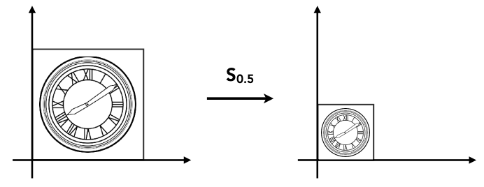

- 非均匀缩放
  - $x^\prime = s_xx$
  - $y^\prime = s_yy$
  
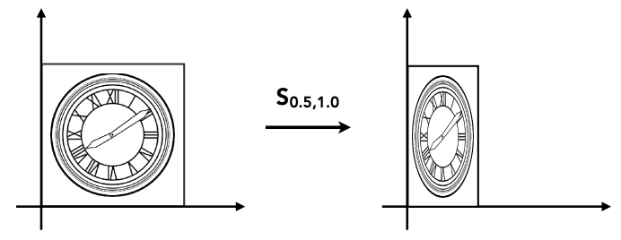

### 缩放矩阵

`缩放矩阵`由单位矩阵和位于 A00, A11 的 x y 轴缩放因子组成:
- 笛卡尔坐标表示
$
S(s_x, s_y) =
\begin{bmatrix}
s_x & 0 \\
0 & s_y \\
\end{bmatrix}
$
- 齐次坐标表示
$
S(s_x, s_y) =
\left(
\begin{matrix}
s_x & 0 & 0 \\
0 & s_y & 0 \\
0 & 0 & 1
\end{matrix}
\right)
$

### 图形的缩放变换计算
- 笛卡尔坐标表达式
$
\left(
\begin{matrix}
x^\prime \\
y^\prime \\
\end{matrix}
\right)
=\begin{bmatrix}
    s_x & 0 \\
    0 & s_y
\end{bmatrix}
×
\left(
\begin{matrix}
    x \\
    y \\
\end{matrix}
\right)
$
- 齐次坐标表达式
$
\left(
\begin{matrix}
x^\prime \\
y^\prime \\
    1
\end{matrix}
\right)
=\left(
\begin{matrix}
    s_x & 0 & 0 \\
    0 & s_y & 0 \\
    0 & 0 & 1
\end{matrix}
\right)
×
\left(
\begin{matrix}
    x \\
    y \\
    1
\end{matrix}
\right)
$

### 向量的缩放变换计算
- 齐次坐标表达式
$
\left(
\begin{matrix}
x^\prime \\
y^\prime \\
    0
\end{matrix}
\right)
=\left(
\begin{matrix}
    s_x & 0 & 0 \\
    0 & s_y & 0 \\
    0 & 0 & 1
\end{matrix}
\right)
×
\left(
\begin{matrix}
    x \\
    y \\
    0
\end{matrix}
\right)
$

## 反射变换 Reflection

反射变换:将以 x 轴或 y 轴做镜像。
- 水平反射
  - $x^\prime = -x$
  - $y^\prime = y$
- 垂直反射
  - $x^\prime = x$
  - $y^\prime = -y$
  
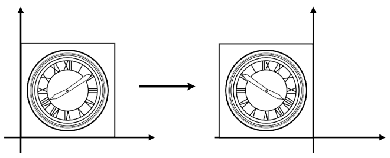

### 反射矩阵

- 水平反射矩阵：
  - 笛卡尔坐标表示
    $
    R =
    \begin{bmatrix}
    -1 & 0 \\
    0 & 1 \\
    \end{bmatrix}
    $
  - 齐次坐标表示
    $
    R =\left(
    \begin{matrix}
    -1 & 0 & 0 \\
    0 & 1 & 0 \\
    0 & 0 & 1
    \end{matrix}
    \right)
    $
- 垂直反射矩阵：
  - 笛卡尔坐标表示
    $
    R = 
    \begin{bmatrix}
    1 & 0 \\
    0 & -1 \\
    \end{bmatrix}
    $
  - 齐次坐标表示
    $
    R = \left(
    \begin{matrix}
    1 & 0 & 0 \\
    0 & -1 & 0 \\
    0 & 0 & 1
    \end{matrix}
    \right)
    $

### 图形的反射变换计算
- 水平反射的计算
  - 笛卡尔坐标表达式
  $
    \begin{bmatrix}
      x^\prime \\
      y^\prime \\
    \end{bmatrix} =
    \begin{bmatrix}
      -1 & 0 \\
      0 & 1 \\
    \end{bmatrix}
    \begin{bmatrix}
      x \\
      y \\
    \end{bmatrix}
  $
  - 齐次坐标表达式
  $
    \left(
    \begin{matrix}
      x^\prime \\
      y^\prime \\
      1
    \end{matrix}
    \right)=
    \left(
    \begin{matrix}
      -1 & 0 & 0\\
      0 & 1 & 0\\
      0 & 0 & 1
    \end{matrix}
    \right)
    \left(
    \begin{matrix}
      x \\
      y \\
      1
    \end{matrix}
    \right)
  $
- 垂直反射的计算
  - 笛卡尔坐标表达式
  $
    \begin{bmatrix}
      x^\prime \\
      y^\prime \\
    \end{bmatrix} =
    \begin{bmatrix}
      1 & 0 \\
      0 & -1 \\
    \end{bmatrix}
    \begin{bmatrix}
      x \\
      y \\
    \end{bmatrix}
  $
  - 齐次坐标表达式
  $
    \left(
    \begin{matrix}
      x^\prime \\
      y^\prime \\
      1
    \end{matrix}
    \right) =
    \left(
    \begin{matrix}
      1 & 0 & 0\\
      0 & -1 & 0\\
      0 & 0 & 1
    \end{matrix}
    \right)
    \left(
    \begin{matrix}
      x \\
      y \\
      1
    \end{matrix}
    \right)
  $

### 向量的反射变换计算
- 水平反射的计算
  - 齐次坐标表达式
  $
    \left(
    \begin{matrix}
      x^\prime \\
      y^\prime \\
      0
    \end{matrix}
    \right) =
    \left(
    \begin{matrix}
      -1 & 0 & 0\\
      0 & 1 & 0\\
      0 & 0 & 1
    \end{matrix}
    \right)
    \left(
    \begin{matrix}
      x \\
      y \\
      0
    \end{matrix}
    \right)
  $
- 垂直反射的计算
  - 齐次坐标表达式
  $
    \left(
    \begin{matrix}
      x^\prime \\
      y^\prime \\
      0
    \end{matrix}
    \right) =
    \left(
    \begin{matrix}
      1 & 0 & 0\\
      0 & -1 & 0\\
      0 & 0 & 1
    \end{matrix}
    \right)
    \left(
    \begin{matrix}
      x \\
      y \\
      0
    \end{matrix}
    \right)
  $

## 剪切变换 Shear

类似于四边形不稳定性那种性质，方形变平行四边形，任意一边都可以被拉长的过程。
- 水平剪切
  - x = 0, y = 0
  - x = a, y = 1
- 垂直剪切
  - x = 0, y = 0
  - x = 1, y = a

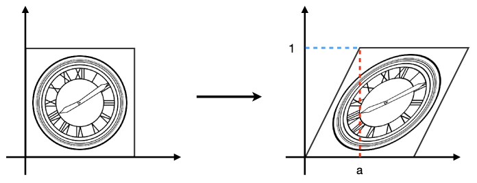

### 剪切矩阵
- 水平剪切矩阵：
  - 笛卡尔坐标表示
    $
    S(a) =
    \begin{bmatrix}
    1 & a \\
    0 & 1 \\
    \end{bmatrix}
    $
  - 齐次坐标表示
    $
    S(a) =
    \left(
    \begin{matrix}
    1 & a & 0 \\
    0 & 1 & 0 \\
    0 & 0 & 1
    \end{matrix}
    \right)
    $
- 垂直剪切矩阵：
  - 笛卡尔坐标表示
    $
    S(a) =
    \begin{bmatrix}
    1 & 0 \\
    a & 1 \\
    \end{bmatrix}
    $
  - 齐次坐标表示
    $
    S(a) =
    \left(
    \begin{matrix}
    1 & 0 & 0 \\
    a & 1 & 0 \\
    0 & 0 & 1
    \end{matrix}
    \right)
    $

### 图形的剪切变换计算
- 水平剪切的计算
  - 笛卡尔坐标表达式
  $
    \begin{bmatrix}
      x^\prime \\
      y^\prime \\
    \end{bmatrix} =
    \begin{bmatrix}
      1 & a \\
      0 & 1 \\
    \end{bmatrix}
    \begin{bmatrix}
      x \\
      y \\
    \end{bmatrix}
  $
  - 齐次坐标表达式
  $
    \left(
    \begin{matrix}
      x^\prime \\
      y^\prime \\
      1
    \end{matrix}
    \right) =
    \left(
    \begin{matrix}
      1 & a & 0\\
      0 & 1 & 0\\
      0 & 0 & 1
    \end{matrix}
    \right)
    \left(
    \begin{matrix}
      x \\
      y \\
      1
    \end{matrix}
    \right)
  $
- 垂直反射的计算
  - 笛卡尔坐标表达式
  $
    \begin{bmatrix}
      x^\prime \\
      y^\prime \\
    \end{bmatrix} =
    \begin{bmatrix}
      1 & 0 \\
      a & 1 \\
    \end{bmatrix}
    \begin{bmatrix}
      x \\
      y \\
    \end{bmatrix}
  $
  - 齐次坐标表达式
  $
    \left(
    \begin{matrix}
      x^\prime \\
      y^\prime \\
      1
    \end{matrix}
    \right) =
    \left(
    \begin{matrix}
      1 & 0 & 0\\
      a & 1 & 0\\
      0 & 0 & 1
    \end{matrix}
    \right)
    \left(
    \begin{matrix}
      x \\
      y \\
      1
    \end{matrix}
    \right)
  $

### 向量的剪切变换计算
- 水平剪切的计算
  - 齐次坐标表达式
  $
    \left(
    \begin{matrix}
      x^\prime \\
      y^\prime \\
      0
    \end{matrix} 
    \right) =
    \left(
    \begin{matrix}
      1 & a & 0\\
      0 & 1 & 0\\
      0 & 0 & 1
    \end{matrix}
    \right)
    \left(
    \begin{matrix}
      x \\
      y \\
      0
    \end{matrix}
    \right)
  $
- 垂直反射的计算
  - 齐次坐标表达式
  $
    \left(
    \begin{matrix}
      x^\prime \\
      y^\prime \\
      0
    \end{matrix}
    \right) =
    \left(
    \begin{matrix}
      1 & 0 & 0\\
      a & 1 & 0\\
      0 & 0 & 1
    \end{matrix}
    \right)
    \left(
    \begin{matrix}
      x \\
      y \\
      0
    \end{matrix}
    \right)
  $

## 旋转变换 Rotation

默认逆时针旋转：

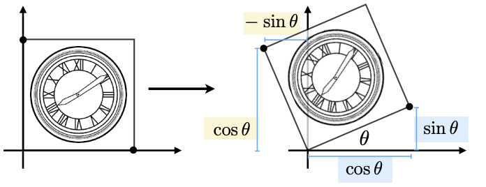

### 旋转矩阵

- 笛卡尔坐标表示
$R(\theta) = 
\begin{bmatrix}
\cos\theta & -\sin\theta \\
\sin\theta & \cos\theta
\end{bmatrix}
$
- 齐次坐标表示
$R(\theta) =
\left( 
\begin{matrix}
\cos\theta & -\sin\theta & 0 \\
\sin\theta & \cos\theta & 0 \\
0 & 0 & 1
\end{matrix}
\right)
$

### 顺时针旋转矩阵
$R_{-\theta} = 
R^T_{\theta} = 
R^{-1}_{\theta} = 
\begin{bmatrix}
\cos\theta & \sin\theta \\
-\sin\theta & \cos\theta
\end{bmatrix} 
$

### 图形的旋转变换计算
- 笛卡尔坐标表达式
  $
  \begin{bmatrix}
    x^\prime \\
    y^\prime \\
  \end{bmatrix} =
  \begin{bmatrix}
    \cos\theta & -\sin\theta \\
    \sin\theta & \cos\theta
  \end{bmatrix}
  \begin{bmatrix}
    x \\
    y \\
  \end{bmatrix}
  $
- 齐次坐标表达式
  $
  \left(
  \begin{matrix}
    x^\prime \\
    y^\prime \\
    1
  \end{matrix}
  \right) =
  \left(
  \begin{matrix}
    \cos\theta & -\sin\theta & 0 \\
    \sin\theta & \cos\theta & 0 \\
    0 & 0 & 1
  \end{matrix}
  \right)
  \left(
  \begin{matrix}
    x \\
    y \\
    1
  \end{matrix}
  \right)
  $

### 向量的旋转变换计算
- 齐次坐标表达式
  $
  \left(
  \begin{matrix}
    x^\prime \\
    y^\prime \\
    0
  \end{matrix}
  \right) =
  \left(
  \begin{matrix}
    \cos\theta & -\sin\theta & 0 \\
    \sin\theta & \cos\theta & 0 \\
    0 & 0 & 1
  \end{matrix}
  \right)
  \left(
  \begin{matrix}
    x \\
    y \\
    0
  \end{matrix}
  \right)
  $

## 线性变换 Linear Transforms

以上所有线性变换的笛卡尔坐标表达式都是同样形式：

$
\begin{bmatrix}
x^\prime \\
y^\prime \\
\end{bmatrix}
=\begin{bmatrix}
a & b \\
c & d \\
\end{bmatrix}
\begin{bmatrix}
x \\
y \\
\end{bmatrix}
$

## 平移变换 Translation

- $x^\prime = x + t_x$
- $y^\prime = y + t_y$

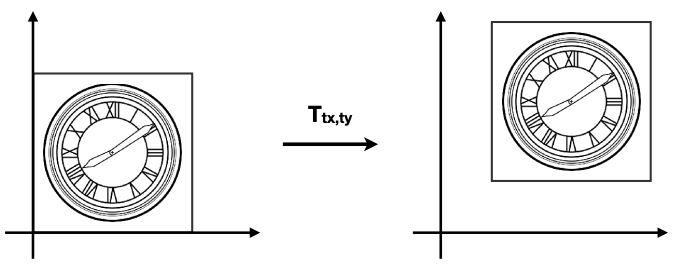

## 平移矩阵
- 齐次坐标表示
$
T(t_x, t_y) =
\left(
\begin{matrix}
1 & 0 & t_x \\
0 & 1 & t_y \\
0 & 0 & 1
\end{matrix}
\right)
$

### 平移变换的计算
- 笛卡尔坐标表达式：
  - 对图形进行平移变换
    $
    \begin{bmatrix}
    x^\prime \\
    y^\prime \\
    \end{bmatrix}
    =\begin{bmatrix}
    1 & 0 \\
    0 & 1 \\
    \end{bmatrix}
    \begin{bmatrix}
    x \\
    y
    \end{bmatrix} +
    \begin{bmatrix}
    t_x \\
    t_y
    \end{bmatrix}
    $
  - 对向量进行平移变换
    $
    \begin{bmatrix}
    x^\prime \\
    y^\prime \\
    \end{bmatrix}
    =\begin{bmatrix}
    1 & 0 \\
    0 & 1 \\
    \end{bmatrix}
    \begin{bmatrix}
    x \\
    y
    \end{bmatrix}
    $
> 图形的平移变换不是线性变换，因为它的笛卡尔坐标表达式不是矩阵乘法，而是矩阵加法。
- 齐次坐标表达式：
  - 对图形进行平移变换
    $
    \left(
    \begin{matrix}
    x^\prime \\
    y^\prime \\
    1
    \end{matrix}
    \right)
    =\left(
    \begin{matrix}
    1 & 0 & t_x \\
    0 & 1 & t_y \\
    0 & 0 & 1
    \end{matrix} \cdot
    \right)
    \left(
    \begin{matrix}
    x \\
    y \\
    1
    \end{matrix}
    \right)
    = \left(
    \begin{matrix}
    x + t_x \\
    y + t_y \\
    1
    \end{matrix}
    \right)
    $
  - 对向量进行平移变换
    $
    \left(
    \begin{matrix}
    x^\prime \\
    y^\prime \\
    0
    \end{matrix}
    \right)
    =\left(
    \begin{matrix}
    1 & 0 & t_x \\
    0 & 1 & t_y \\
    0 & 0 & 1
    \end{matrix} \cdot
    \right)
    \left(
    \begin{matrix}
    x \\
    y \\
    0
    \end{matrix}
    \right)
    = \left(
    \begin{matrix}
    x + t_x \\
    y + t_y \\
    0
    \end{matrix}
    \right)
    $

## 齐次坐标系 Homogenous Coordinates

通过为图形或向量引入 w 坐标（有效值为 1 或 0），可以将所有`仿射变换`(Affine Transformations)计算表达式统一为

$
\left(
\begin{matrix}
x^\prime \\
y^\prime \\
w^\prime \\
\end{matrix}
\right)
= \left(
\begin{matrix}
a & b & t_x \\
c & d & t_y \\
0 & 0 & 1
\end{matrix}
\right) \cdot
\left(
\begin{matrix}
x \\
y \\
w
\end{matrix}
\right)
$

齐次坐标下：
- 向量 + 向量 = 向量
- 点 - 点 = 向量
- 点 + 向量 = 点
- 点 + 点 = 两点之间的中点

对于任意：$
\left(
\begin{matrix}
x \\
y \\
w
\end{matrix}
\right)
$ (w != 0)，可以转换为 2D 齐次坐标点 $
\left(
\begin{matrix}
x/w \\
y/w \\
1
\end{matrix}
\right)
$

## 逆变换 Inverse Transforms

对于一个变换矩阵 $M$ ，存在一个逆变换矩阵 $M^{-1}$

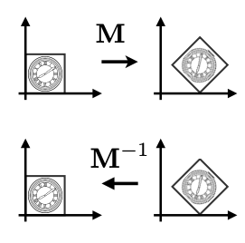

## 组合变换 Composite Transforms

可以将一系列仿射变换矩阵组合起来获得一个新的矩阵。

$A_n(...A_2(A_1(x))) = 
A_n \cdot\cdot\cdot A_2 \cdot A_1 \cdot
\left(
\begin{matrix}
x \\
y \\
1
\end{matrix}
\right)$

> 对性能非常重要！

以下变换如何实现？

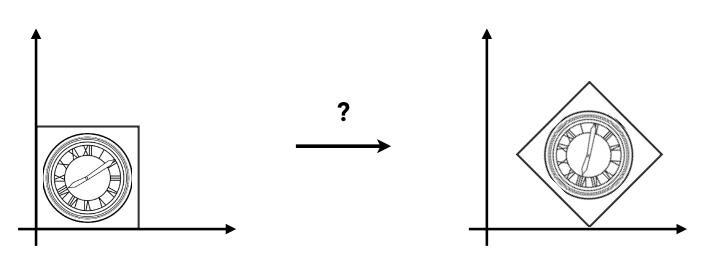

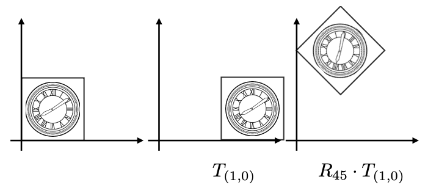

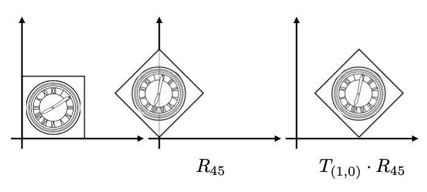

上述仿射变换表达式为：

$$
T_{(1, 0)} \cdot R_{45} = 
\left(
\begin{matrix}
1 & 0 & 0 \\
0 & 1 & 0 \\
0 & 0 & 1
\end{matrix}
\right)
\left(
\begin{matrix}
cos(45^\circ) & -sin(45^\circ) & 0 \\
sin(45^\circ) & cos(45^\circ) & 0 \\
0 & 0 & 1
\end{matrix}
\right)
\left(
\begin{matrix}
x \\
y \\
1
\end{matrix}
\right)
$$

> 矩阵乘法是右结合的（从右向左计算）

所以，变换的顺序非常重要

$$R_{45} \cdot T_{(1, 0)} != T_{(1, 0)} \cdot R_{45}$$

## 分解组合变换

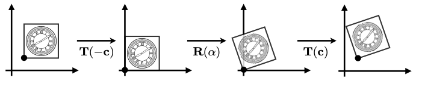

上面变换过程可分解为：
$
M = T(c) \cdot R(\alpha) \cdot T(-c)
$