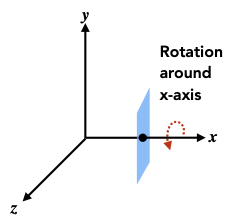

- [3D 空间齐次坐标](#3d-空间齐次坐标)
- [平移矩阵](#平移矩阵)
- [缩放矩阵](#缩放矩阵)
- [旋转变换](#旋转变换)
  - [旋转矩阵](#旋转矩阵)
  - [反向旋转](#反向旋转)
  - [罗格里格斯旋转公式](#罗格里格斯旋转公式)

## 3D 空间齐次坐标
点：
$
\left(
\begin{matrix}
x \\
y \\
z \\
1
\end{matrix}
\right)
$

向量：
$
\left(
\begin{matrix}
x \\
y \\
z \\
0
\end{matrix}
\right)
$

## 平移矩阵

平移矩阵由一个单位矩阵，和位于 A03 A13 A23 的 X Y Z 轴移动因子 $t_x$ $t_y$ $t_z$ 组成:

$
T(t_x, t_y, t_z) =
\left(
\begin{matrix}
1 & 0 & 0 & t_x \\
0 & 1 & 0 & t_y \\
0 & 0 & 1 & t_z \\
0 & 0 & 0 & 1
\end{matrix}
\right)
$

一个点的齐次坐标 $(x, y, z, 1)$ 与平移矩阵 $T(t_x, t_y, t_z)$ 相乘，得到的是以平移值移动后的点：

$
\left(
\begin{matrix}
    x + t_x \\
    y + t_y \\
    z + t_z \\
    1
\end{matrix}
\right)
= \left(
\begin{matrix}
    1 & 0 & 0 & t_x \\
    0 & 1 & 0 & t_y \\
    0 & 0 & 1 & t_z \\
    0 & 0 & 0 & 1
\end{matrix}
\right)
×
\left(
\begin{matrix}
    x \\
    y \\
    z \\
    1
\end{matrix}
\right)
$

 

GLM 使用 glm::translate(x, y ,z) 构建平移矩阵

## 缩放矩阵

缩放矩阵用于改变物体的大小，或将点向原点相反方向移动。

缩放矩阵由单位矩阵和位于 A00, A11, A22 的 x y z 轴缩放因子组成:

$
S(s_x, s_y, s_z)=
\left(
\begin{matrix}
s_x & 0 & 0 & 0 \\
0 & s_y & 0 & 0 \\
0 & 0 & s_z & 0 \\
0 & 0 & 0 & 1
\end{matrix}
\right)
$

缩放矩阵 $S(s_x, s_y, s_z)$ 和点的齐次坐标 $(x, y, z, 1)$ 相乘得到缩放后的新点：

$
\left(
\begin{matrix}
    x * s_x \\
    y * s_y \\
    z * s_z \\
    1
\end{matrix}
\right)
= \left(
\begin{matrix}
s_x & 0 & 0 & 0 \\
0 & s_y & 0 & 0 \\
0 & 0 & s_z & 0 \\
0 & 0 & 0 & 1
\end{matrix}
\right)
×
\left(
\begin{matrix}
    x \\
    y \\
    z \\
    1
\end{matrix}
\right)
$

GLM 中的 glm::scale(x, y, z) 构建缩放矩阵

使用以下的特殊缩放矩阵，可以通过反转 z 轴坐标在右手坐标系和左手坐标系之间切换：

$
\left(
\begin{matrix}
1 & 0 & 0 & 0 \\
0 & 1 & 0 & 0 \\
0 & 0 & -1 & 0 \\
0 & 0 & 0 & 1
\end{matrix}
\right)
$

## 旋转变换

### 旋转矩阵

旋转矩阵有三种，分别是绕 x 、y 、z 轴旋转:

- $
R_x(\alpha) = 
\left(
\begin{matrix}
1 & 0 & 0 & 0 \\
0 & cos\alpha & -sin\alpha & 0 \\
0 & sin\alpha & cos\alpha & 0 \\
0 & 0 & 0 & 1
\end{matrix}
\right)
$
> 等价于在 yz 平面上旋转 $\alpha$ 度，也就是在 $\vec y \times \vec z$ 确定的平面上旋转

- $
R_y(\beta) =
\left(
\begin{matrix}
cos\beta & 0 & sin\beta & 0 \\
0 & 1 & 0 & 0 \\
-sin\beta & 0 & cos\beta & 0 \\
0 & 0 & 0 & 1
\end{matrix}
\right)
$
> $
\left(
\begin{matrix}
cos\beta & 0 & -sin\beta \\
0 & 1 & 0 \\
sin\beta & 0 & cos\beta \\
\end{matrix}
\right)
$ 等价于在 xz 平面上旋转 $\alpha$ 度，也就是在 $\vec x \times \vec z$ 确定的平面上旋转，然而这个旋转在 $\vec z \times \vec x$ 确定的平面上是顺时针的，所以需要反转 z 轴，得到转置矩阵 $
\left(
\begin{matrix}
cos\beta & 0 & sin\beta \\
0 & 1 & 0 \\
-sin\beta & 0 & cos\beta \\
\end{matrix}
\right)
$
- $
R_z(\gamma) =
\left(
\begin{matrix}
cos\gamma & -sin\gamma & 0 & 0 \\
sin\gamma & cos\gamma & 0 & 0 \\
0 & 0 & 1 & 0 \\
0 & 0 & 0 & 1
\end{matrix}
\right)
$
> 等价于在 xy 平面上旋转 $\alpha$ 度，也就是在 $\vec x \times \vec y$ 确定的平面上旋转

围绕任何轴的旋转都可以表示为围绕 x y z 轴旋转的组合，围绕这三个轴旋转角度被称为欧拉角。

$$R_{xyz}(\alpha, \beta, \gamma) = R_x(\alpha)R_y(\beta)R_z(\gamma)$$
 
GLM 库使用 glm::rotate(mat4, ⍬, x, y, z) 构造绕 x y z 轴旋转 ⍬ 度的旋转矩阵。
  

### 反向旋转

反向旋转的矩阵恰好等于其转置矩阵。

旋转矩阵中，cos(-⍬) = cos(⍬) ， sin(-⍬) = -sin(⍬)

### 罗格里格斯旋转公式

任意 3D 旋转都可以用罗格里格斯旋转公式表示，公式如下：

$R(n,\alpha) = 
cos(α)I + 
(1 -cos(\alpha))nn^T + 
sin(\alpha)
    \left(
        \begin{matrix}
            0 & -n_z & n_y \\
            n_z & 0 & -n_x \\
            -n_y & n_x & 0
        \end{matrix} 
    \right)
$
- $n$ ：旋转轴
- $\alpha$ : 旋转角度

$$
\mathbf{R}(\mathbf{n}, \alpha)=\cos (\alpha) \mathbf{I}+(1-\cos (\alpha)) \mathbf{n} \mathbf{n}^{T}+\sin (\alpha) \underbrace{\left(\begin{array}{ccc} 0 & -n_{z} & n_{y} \\ n_{z} & 0 & -n_{x} \\ -n_{y} & n_{x} & 0 \end{array}\right)}_{\mathbf{N}}
$$

$$
R(n,α)=cos(α)I+(1−cos(α))nnT+sin(α)N
$$

