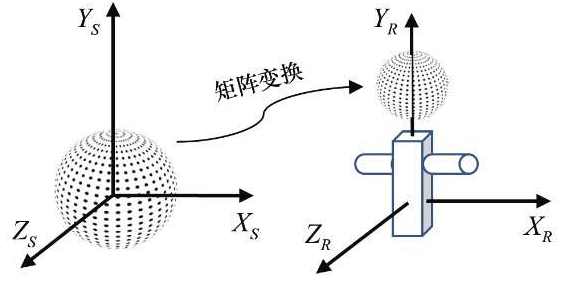

## 物体空间

当建立物体的 3D 模型时，通常以最方便的定位方式描述这个模型，例如，一个球形模型，球心定位于原点（0, 0, 0），半径为 1。

这个模型所定义的空间叫做局部空间或模型空间，OpenGL 使用的术语是物体空间。

一个模型可能用于一个大模型的一部分，例如，可以通过矩阵变换（缩放、旋转、平移）将球形模型放在机器人模型空间。通过这种方式，可以分层次地构建复杂模型。

## 世界空间

使用同样的方式，可以通过设定物体在模型世界中的朝向和大小，将物体放在模拟世界的空间中。模拟世界的空间叫做`世界空间`，将模型定位及定向在世界空间的仿射变换矩阵成为`模型矩阵`或 $M$ 。

