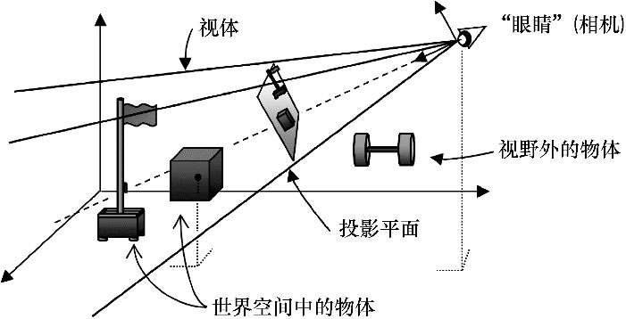
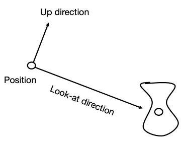
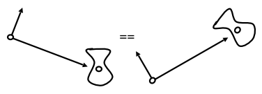
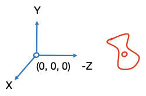
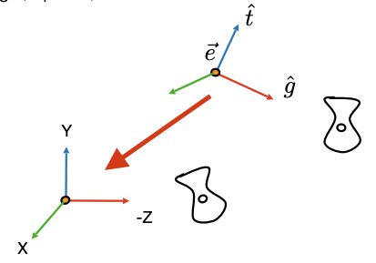

## 视觉变换 View Transformation

观察 3D 世界需要：
- 将相机放在世界空间的某个位置
- 调整相机的角度，通常需要一套它自己的直角坐标系
- 定义一个视体（view volume）
- 将视体内的对象投影到投影平面上

其中，放置相机和调整相机角度的操作称为视图变换。

## 应用视图变换

1. 定义相机
  - 定义相机位置 $\vec e$
  - 定义镜头朝向 $\vec g$(指向被观察物体)
  - 定义向上的向量 $\vec t$，用来固定相机绕 $\vec g$ 轴的旋转角度 
    
  - 定义相机空间：
    - 考虑到被观察物体的变换跟随相机的移动，如下所示：
      
    - 引入相机空间，将相机位置定义在原点，$\vec g$ 指向 $-z$ 轴，$\vec t$ 指向 $y$ 轴：
      
2. 引入`视图变换矩阵` $M_{view}$ ，将物体世界空间中转换到相机空间中：
 
    具体的变换公式如下：
    $$
    p^\prime=M_{view}p_w
    $$
    通常，在应用 $M_{view}$ 之前，需要事先使用模型矩阵 $M_{model}$ 实现确定图形在世界空间中的位置（模型变换 Model Transformation），整个过程也称为模型视图变换 ModelView Transformation ，具体变换公式如下：
    $$
    p^\prime=M_{view}M_{model}p_w
    $$

## 推导视图变换矩阵 $M_{view}$
1. $M_{view}$ 由平移矩阵$T_{view}$和旋转矩阵$W_{view}$组合而成：
$M_{view} = R_{view}T_{view}$
- 其中，$T_{view}$ 用于将相机位置移动到原点：$
  T_{view} = \begin{bmatrix}
    1 & 0 & 0 & -x_e \\
    0 & 1 & 0 & -y_e \\
    0 & 0 & 1 & -z_e \\
    0 & 0 & 0 & 1
    \end{bmatrix}
  $
- $R_{view}=
  \begin{bmatrix}
    x_{\hat g \times \hat t} & y_{\hat g \times \hat t} & z_{\hat g \times \hat t} & 0 \\
    x_{t} & y_{t} & z_{t} & 0 \\
    x_{-g} & y_{-g} & z_{-g} & 0 \\
    0 & 0 & 0 & 1
  \end{bmatrix}
  $，作用如下：
  -  $\vec g$ 旋转到 $-\vec {z}$ 轴
  -  $\vec t$ 旋转到 $y$ 轴
  -  $\vec g \times \vec t$ 旋转到 $x$ 轴。
> $R_{view}$ 不好解出，考虑到旋转矩阵是正交矩阵，可知 $R_{view}=(R^{-1})^T$ ，且 $R_{view}^{-1}$($x$ 转 $(g \times t)$，$y$ 转 $t$，$z$ 转 $-g$ )容易解出：$R_{view}^{-1} = \begin{bmatrix}
    x_{\hat g \times \hat t} & x_t & x_{-g} & 0 \\
    y_{\hat g \times \hat t} & y_t & y_{-g} & 0 \\
    z_{\hat g \times \hat t} & z_t & z_{-g} & 0 \\
    0 & 0 & 0 & 1
  \end{bmatrix}$ ，通过转置 $R_{view}^{-1}$ 得到 $R_{view}$。