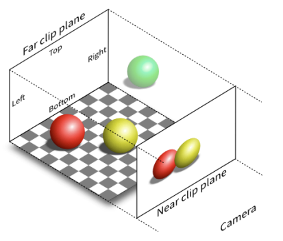
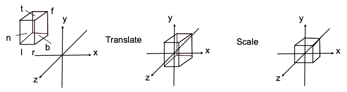
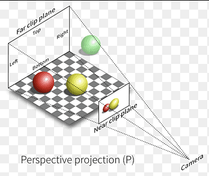
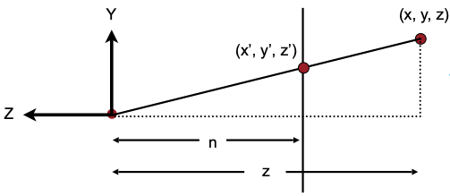
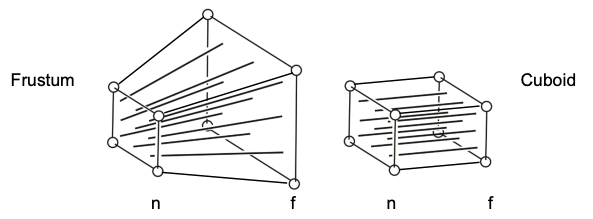

- [正交投影 Orthographic Projection](#正交投影-orthographic-projection)
  - [正交投影矩阵](#正交投影矩阵)
- [透视投影 Perspective Projection](#透视投影-perspective-projection)
  - [透视投影矩阵](#透视投影矩阵)

## 正交投影 Orthographic Projection

正射投影是一种平行投影，其相机空间（也就是视体 view）中所有物体的投影都与投影平面垂直。视体通过如下参数构建：
- 从相机到投影平面（N 面）的距离 n
- 从相机到远剪裁平面（F 面）的距离 f
- l、r、t、b : 其中 L 和 R 分别是投影平面左右边界的 X 坐标，T 和 B 分别是投影平面上下边界的Y坐标

通过引入正交投影矩阵$M_{projection}$，可以将视体内的点 $p^\prime=M_{view}M_{model}p_w$ 转换到正交投影空间中：
$$
p^{\prime\prime}=M_{projection}p^\prime=(M_{projection}M_{view}M_{model})p_w
$$

正交投影应用于投射阴影、3D裁剪以及 CAD 等场景。

### 正交投影矩阵

 $M_{ortho}= \begin{bmatrix}
        \frac{2}{r-l} & 0 & 0 & 0 \\
        0 & \frac{2}{t-b} & 0 & 0 \\
        0 & 0 & \frac{2}{n-f} & 0 \\
        0 & 0 & 0 & 1
    \end{bmatrix}
 \begin{bmatrix}
        1 & 0 & 0 & -\frac{r+l}2 \\
        0 & 1 & 0 & -\frac{t+b}2 \\
        0 & 0 & 1 & -\frac{n+f}2 \\
        0 & 0 & 0 & 1
    \end{bmatrix}
$

构建正交投影矩阵过程如下：
- 将正交投影视体抽象为一个长方体 $[l, r] \times [b, t] \times [f, n]$
- 将正交投影视转化为正交投影空间：
  - 将视体平移到坐标原点
  - 将视体缩放为立方体 $[-1, 1]^3$(也就是最终的正交投影空间)

上述过程如下图所示：

所以，很容易得出正交投影矩阵:

 $M_{ortho} = S(\frac{2}{r-l},\frac{2}{t-b}, \frac{2}{n-f})T(\frac{r+l}2,\frac{t+b}2, \frac{n+f}2) = \begin{bmatrix}
        \frac{2}{r-l} & 0 & 0 & 0 \\
        0 & \frac{2}{t-b} & 0 & 0 \\
        0 & 0 & \frac{2}{n-f} & 0 \\
        0 & 0 & 0 & 1
    \end{bmatrix}
 \begin{bmatrix}
        1 & 0 & 0 & -\frac{r+l}2 \\
        0 & 1 & 0 & -\frac{t+b}2 \\
        0 & 0 & 1 & -\frac{n+f}2 \\
        0 & 0 & 0 & 1
    \end{bmatrix}
$

## 透视投影 Perspective Projection

透视投影模仿人眼看到的世界，尝试让 2D 图像看起来像是 3D 的，物体近大远小，透视投影视体中，所有平行线都不再平行。

### 透视投影矩阵

透视投影矩阵如下：

$$
M_{persp} = M_{ortho}
\left(
    \begin{matrix}
        n & 0 & 0 & 0 \\
        0 & n & 0 & 0 \\
        0 & 0 & n + f & -nf \\
        0 & 0 & 0 & 1
    \end{matrix}
    \right)
$$
两个相关概念：
- 在 3D 空间中，齐次坐标坐标$(x, y, z, 1)$、$(kx, ky, kz, k)$、$\boldsymbol{(xz, yz, z^2, z)}$为同一个点
- 如下图所示，透视投影视体内部$(x\prime, y\prime, z\prime)$ 与 $(x, y, z)$的关系为:
  - $x\prime=\frac{n}zx$
  - $y\prime=\frac{n}zy$
  - $z\prime$ 不变

构建透视投影矩阵过程如下：
- 将透视视图视体压缩为正交视图视体: 
  - $N$ 面 $[2x, 2y]^2$不变
  - 引入压缩矩阵 $M^{4\times4}_{persp \rightarrow ortho}$ ，将 $F$ 面压缩为 $F[2x, 2y]^2$ 
  
    

    - 通过压缩 F 面可知，对于 F 面上任意一点$p(x, y, z, 1)$， 其压缩后的坐标 $p\prime(nx/z, ny/z, ?, 1)$
      > z 值暂时无法确定，所以置空
    - $p\prime$ 坐标乘一个数，得到：$
  \left(
  \begin{matrix}
    nx/z \\
    ny/z \\
    ? \\
    1
  \end{matrix}
  \right) == \left(
    \begin{matrix}
        nx \\
        ny \\
        ? \\
        z
    \end{matrix}
    \right)
  $
    - 引入压缩矩阵 $M^{4\times4}_{persp \rightarrow ortho}$，可知：$M^{4\times4}_{persp \rightarrow ortho}
      \left(
      \begin{matrix}
        x \\
        y \\
        z \\
        1
      \end{matrix}
      \right) == \left(
        \begin{matrix}
            nx \\
            ny \\
            ? \\
            z
        \end{matrix}
        \right)
      $
        - 到这里，可以得到 $M^{4\times4}_{persp \rightarrow ortho}=
          \left(
        \begin{matrix}
            n & 0 & 0 & 0 \\
            0 & n & 0 & 0 \\
            ? & ? & ? & ? \\
            0 & 0 & 0 & 1
        \end{matrix}
        \right)
          $
- 因为，将 N 面上的任意一点$(x, y, n, 1)$应用 $M^{4\times4}_{persp \rightarrow ortho}$ 不会改变，可知 $M^{4\times4}_{persp \rightarrow ortho}\left(\begin{matrix}
    x \\
    y \\
    n \\
    1
  \end{matrix}\right) = 
  \left(\begin{matrix}
    x \\
    y \\
    n \\
    1
  \end{matrix}\right) =
  \left(\begin{matrix}
    nx \\
    ny \\
    n^2 \\
    n
  \end{matrix}\right)$ ，从而得到 $M^{4\times4}_{persp \rightarrow ortho}$ 第三行是 $\boldsymbol{\left(\begin{matrix}0 & 0 & A & B\end{matrix}\right)}$ ，也就得出$
  \left(\begin{matrix}
    0 & 0 & A & B \\
  \end{matrix}\right)
  \left(\begin{matrix}
    x \\
    y \\
    n \\
    1
  \end{matrix}\right)= n^2 \Longrightarrow \boldsymbol{An + B = n^2}$。
- 因为 F 面任意一点$(x, y, z, 1)$应用 $M^{4\times4}_{persp \rightarrow ortho}$ ，z 值不会改变，可知 $
  M^{4\times4}_{persp \rightarrow ortho}\left(\begin{matrix}
    0 \\
    0 \\
    f \\
    1
  \end{matrix}\right) = \left(\begin{matrix}
    0 \\
    0 \\
    f \\
    1
  \end{matrix}\right) ==\left(\begin{matrix}
    0 \\
    0 \\
    f^2 \\
    f
  \end{matrix}\right)
  $ 也就得出 $\left(\begin{matrix}
  0 & 0 & A & B \\
  \end{matrix}\right)\left(\begin{matrix}
    0 \\
    0 \\
    f \\
    1
  \end{matrix}\right) = f^2 \Longrightarrow \boldsymbol{Af + B = f^2}$。
- 根据 $An + B = n^2$ 和 $Af + B = f^2$ 得到 $A=n+f$ 和 $B = -nf$ ，也就最终得出 $\boldsymbol{M^{4\times4}_{persp \rightarrow ortho} = 
  \left(
    \begin{matrix}
        n & 0 & 0 & 0 \\
        0 & n & 0 & 0 \\
        0 & 0 & n + f & -nf \\
        0 & 0 & 0 & 1
    \end{matrix}
    \right)}
  $
- 到这里，已经将透视投影视体转换为正交投影视体，然后合并 $M^{4\times4}_{persp \rightarrow ortho}$ 和 $M_{ortho}$ 即可得出 $M_{persp}$ 
