- [光栅化 Rasterize](#光栅化-rasterize)
  - [光栅化过程：](#光栅化过程)
  - [采样](#采样)
  - [绘制](#绘制)
- [反走样 AntiAliasing](#反走样-antialiasing)
  - [计算机图形学中的采样失真（Sampling Artifacts）](#计算机图形学中的采样失真sampling-artifacts)
  - [解决采样失真：](#解决采样失真)
  - [滤波 filtering](#滤波-filtering)
  - [实现光栅化反走样 AntiAliasing](#实现光栅化反走样-antialiasing)

## 光栅化 Rasterize

将图像绘制到屏幕上。

屏幕是一种光栅显示器：
- 像素数组
- 像素的数量：分辨率
- 像素 pixel：picture element 的缩写
  - 显示 uniform color：RGB 混合的颜色，通过灰度调整色调的明暗

### 光栅化过程：
- 定义屏幕空间$[0, width] \times [0, height]$：
  - 像素的索引从（0,0）到$(width-1, height-1)$
  - 像素$（x，y）$居中于$(x+0.5，y+0.5)$
  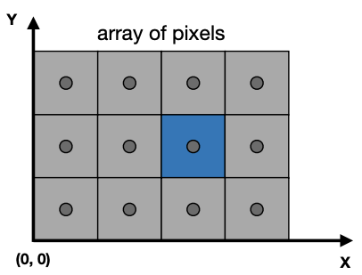
- 将图形从正交投影空间$[-1,1]^3$ 转换到屏幕空间$[0, width] \times [0, height]$
  - 忽略 $[-1,1]^3$ 的 z 轴，也就是只考虑 $[-1,1]^2$
  - 引入 Viewport 转换矩阵 $M_{viewport}$ 将 $[-1,1]^2$ 转换到 $[0, width] \times [0, height]$：
  $$
    M_{viewport} =
    \left(
    \begin{matrix}
      width/2 & 0 & 0 & width/2 \\
      0 & height/2 & 0 & height/2 \\
      0 & 0 & 1 & 0 \\
      0 & 0 & 0 & 1
    \end{matrix}
    \right)
  $$
- 将图形绘制到光栅显示器
  这里以绘制三角形为例，输入三角形在屏幕空间中的顶点坐标，输出一组近似三角形的像素值：
  - 对三角形进行采样，判断样采样到的像素数据是否在三角形的范围内，是则为像素数据设置颜色
  - 根据采样到的像素数据绘制像素

  > 3D 图形由多边形网格构成，三角形是多边形分解后的最基本图形。

### 采样

采样是将函数离散化的过程：
```
for (int x = 0; x < xmax; ++x)
  for (int y = 0; y < ymax; ++y)
  image[x][y] = inside(tri, x + 0.5, y + 0.5);
```

通过对三角形按以下规则进行采样：
```
fun inside(triangle, x, y) {
  if (inTriangle(Point(x, y), triangle))
    return 1;
  else
    return 0;
}
```

可以得到：

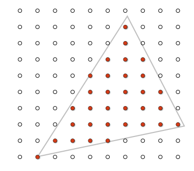

inTriangle 规则可以使用向量叉乘计算：

$\overrightarrow{AB} \times \overrightarrow{AP} > 0$ && $\overrightarrow{BC} \times \overrightarrow{BP} > 0$ && $\overrightarrow{CA} \times \overrightarrow{CP} > 0$ 

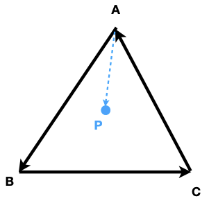

采样需要考虑边界处理，例如以下情况：

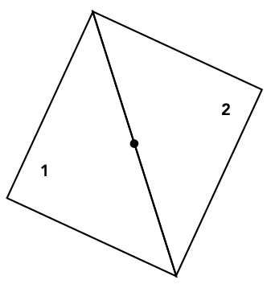

可以认为点即在三角形 T1 上，也在三角形 T2 上（大多数情况），也可以认为在 T2 上（OpenGL：取上边和左边）

### 绘制

包围盒：绘制像素时，不一定要绘制屏幕内的全部像素，可以绘制一个轴向包围盒（ Axis Aligned Bounding Box ，缩写AABB），只绘制包围图形的像素。

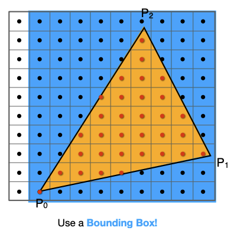

增量三角形遍历：

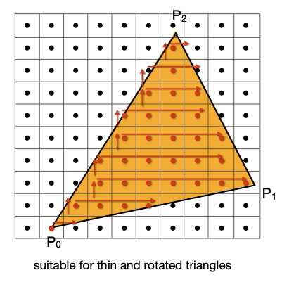

到这里，就在屏幕上绘制出走样（Jaggies、Aliasing）的三角形


需要进行反走样 AntiAliasing 处理。

## 反走样 AntiAliasing 

### 计算机图形学中的采样失真（Sampling Artifacts）

常见的采样失真：
- 隔行隔列采样导致的摩尔纹（Moire Pattern）

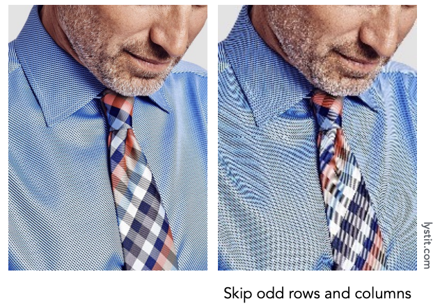

- 采样速率过慢导致的车轮逆向旋转错觉

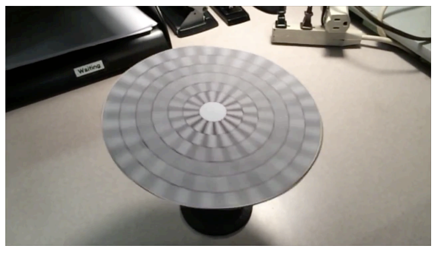

采样失真的本质：信号变化太快（频率高），但采样太慢。

例如：

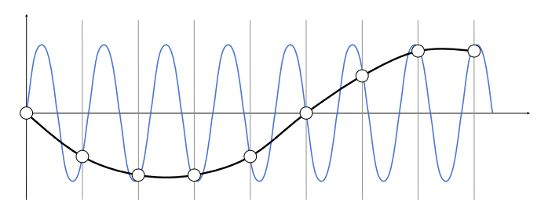

对上图蓝色的波形按照灰色冲激函数的进行采样，还原后的波形出现失真。

上述失真的根本原因在于，相对较慢的采样频率（稀疏采样 Sparse sampleing）导致获得的频域数据出现混叠：
- 采样越密集，频域上的内容（频谱）则不容易出现混叠

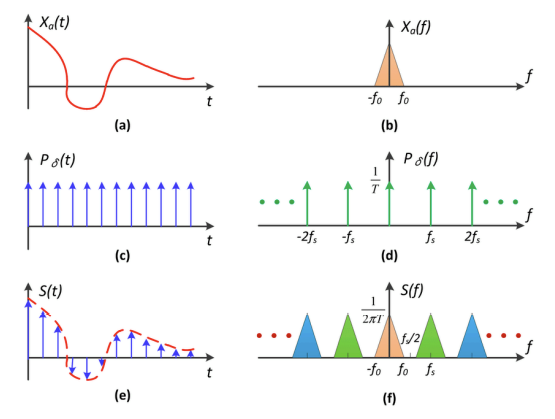

- 采样过稀疏，频谱则会出现混叠

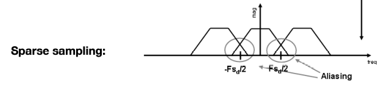

> 通过傅里叶变换 Fourier Transform 将图像信号从时域（或者叫空间域）转换到频域

> 采样就是在空间轴上重复原始信号的频谱

> 时域上的乘积，等价于频域上的卷积

### 解决采样失真：

在采样前进行模糊处理（blur）

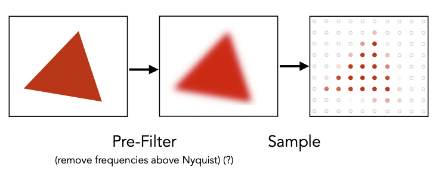

### 滤波 filtering

模糊处理的本质是对图形信号进行低通滤波，过滤掉高频信号（高对比度信号），可使图像变得模糊，例如：

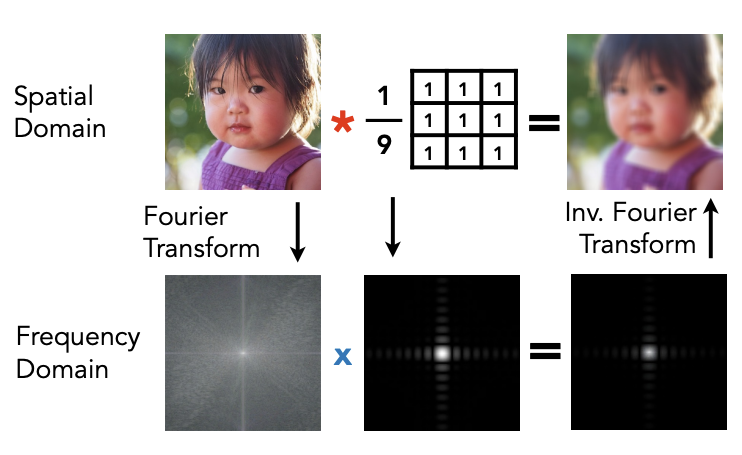

上图的示例对原图像使用 $9\times9$ Box Filter 进行卷积（Convolution）操作，过滤掉高频信号，使图像变得模糊。

### 实现光栅化反走样 AntiAliasing

反走样的实现基于模糊处理（去掉高频信号）

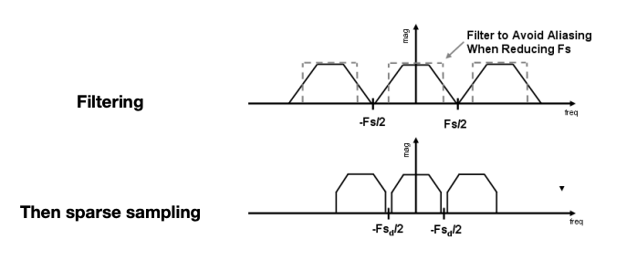

对于光栅化这一场景，以像素为单位进行滤波处理：
- 计算三角形对像素的覆盖率，然后以覆盖率为像素颜色的灰度值。

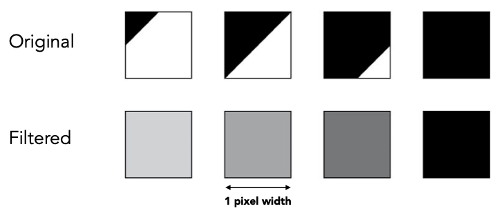

这里的关键在于计算三角形对像素的覆盖率，可使用超采样技术（supersampling）:
- 对每个像素进行 $2\times2$ 的超采样

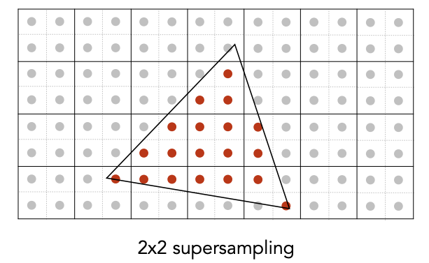
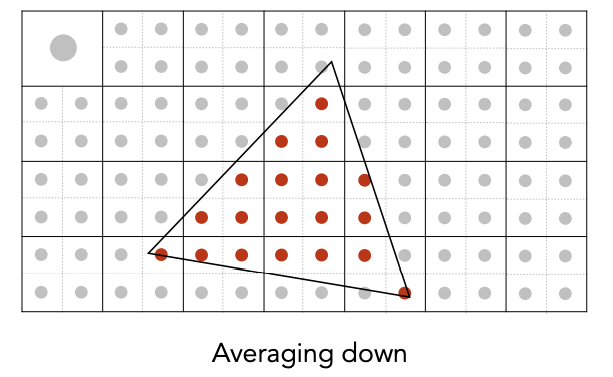
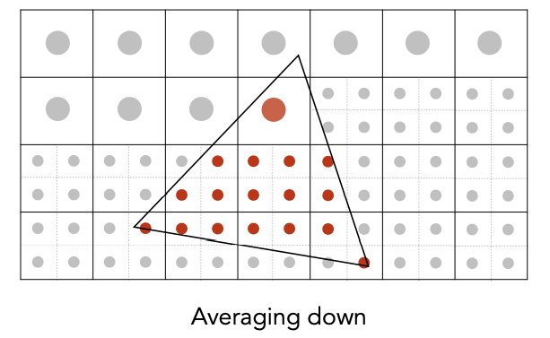
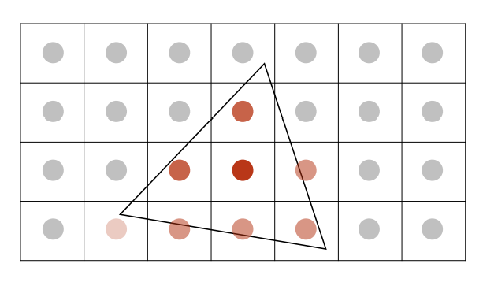

- 计算超采样的平均值，这个平均值就是覆盖率

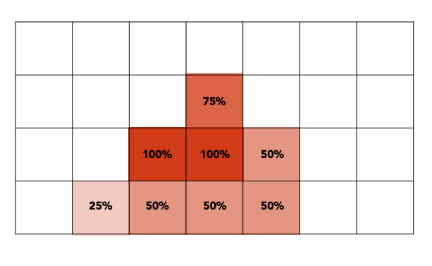
